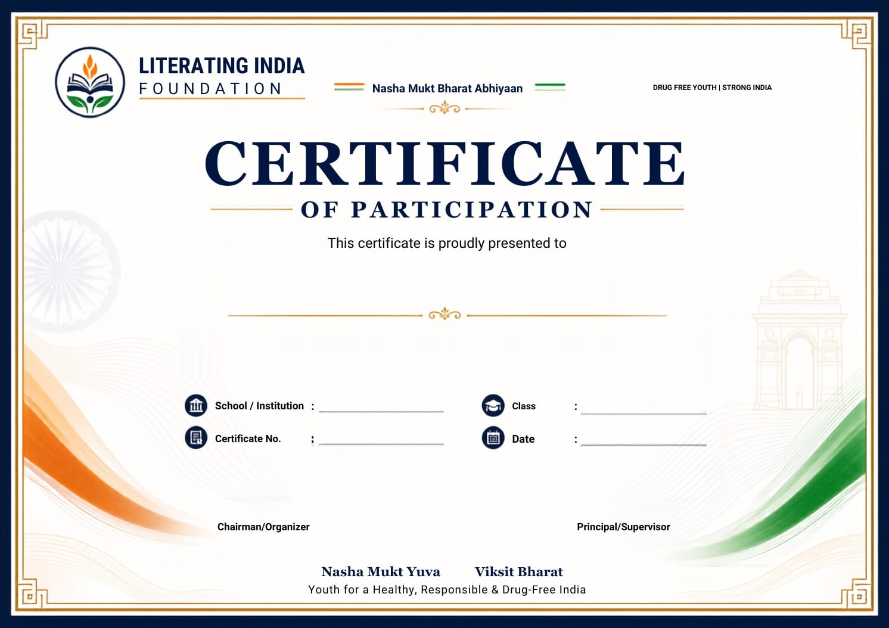

# 🪷 Literating India Foundation - Dynamic Certificate Generator

Official Single-Page Web Application for generating personalized, high-fidelity **"Nasha Mukt Yuva"** participation certificates for the Literating India Foundation under the *Nasha Mukt Bharat Abhiyaan*.



---

## 🚀 Live Demo & Deployment

This project is a static, zero-backend single-page web app built with vanilla HTML5, modern CSS, and JavaScript. It is 100% production-ready and can be deployed with one click to **Vercel**, **Netlify**, or **GitHub Pages**.

### Deploy to Vercel
```bash
# Using Vercel CLI
npx vercel
```
Or import this repository directly in the [Vercel Dashboard](https://vercel.com/new).

---

## ✨ Features

- **Strict Lookup & Zero Manual Typing**: Search participants from the embedded dataset (47 verified records).
- **Disambiguation for Duplicate Names**: Distinctly identifies repeating names (e.g. *Harnoor Kaur* across 6th, 7th, and 8th classes) with real-time badges for Topic, Class, and unique Certificate Serial Number.
- **Identity Confirmation Layer**: Confirms identity via phone number matching (supports full 10-digit number or last 4 digits) and automatically bypasses verification for records with `phone: null`.
- **Calibrated Canvas Compositing**: Uses HTML5 Canvas to composite dynamic typography (`Cinzel`, `Playfair Display`, `Plus Jakarta Sans`) onto the 1492×1054 certificate template with calibrated baselines and automatic text-fitting.
- **Unique Certificate Numbers per Participant**: Deterministically maps serial numbers to database record IDs (`LIF-NMYA-2026-001` to `047`).
- **Fixed Event Details**: Pre-configured for School (`SGHPS CHOWK PRAGDASS`) and Issue Date (`28 August 2026`).
- **Multiple Export Formats**:
  - **Full-Res PNG**: High-resolution 1492×1054 crisp image.
  - **Single-Page PDF**: Scaled landscape PDF without margins via `jsPDF`.
  - **Print Dialog**: Clean print stylesheet.
- **Participants Directory**: Searchable, filterable table view across all authoritative database records with 1-click selection.
- **Database-Exclusive Records**: Participant records are managed exclusively in the backend database dataset (`js/data.js` and `participants.json`), preventing arbitrary client-side additions.
- **Fully Responsive**: Mobile-first layout with touch-friendly 48px targets, floating quick-action bar, and responsive auto-fitting canvas preview.

---

## 📁 Project Structure

```
Dynamic_Certificate_Generator/
├── index.html                   # Main HTML5 application entry point
├── vercel.json                  # Vercel routing & security headers config
├── package.json                 # Project scripts & metadata
├── .gitignore                   # Standard production gitignore
├── participants.json            # Embedded dataset (47 records with IDs)
├── test_suite.js                # Automated verification test suite
├── certificate_template.jpeg    # High-res certificate base template (1492x1054)
├── css/
│   └── style.css                # Luxury design system (Navy, Gold, Glassmorphic UI)
└── js/
    ├── data.js                  # Participant dataset & search logic
    ├── config.js                # Named canvas coordinates & styling constants
    ├── certificate.js           # HTML5 Canvas compositing engine
    ├── pdf-exporter.js          # Single-page landscape PDF exporter
    └── app.js                   # Application state, events, and UI controller
```

---

## 🛠️ Local Development

### 1. Prerequisites
- [Node.js](https://nodejs.org/) (v16+)

### 2. Start Local Development Server
```bash
npm run dev
# Or: npx serve . -l 3000
```
Open **`http://localhost:3000`** in your browser.

### 3. Run Automated Tests
```bash
npm test
```

---

## 📜 License
MIT License • Literating India Foundation
